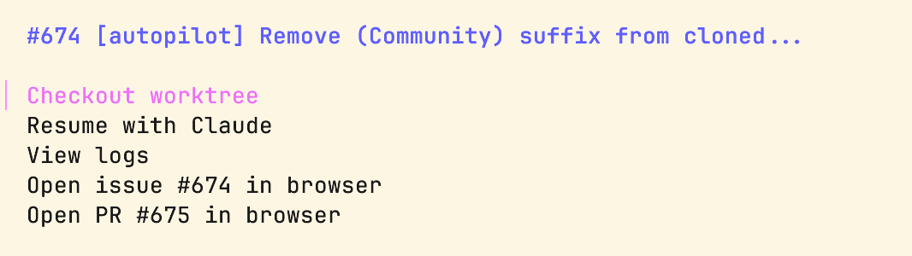
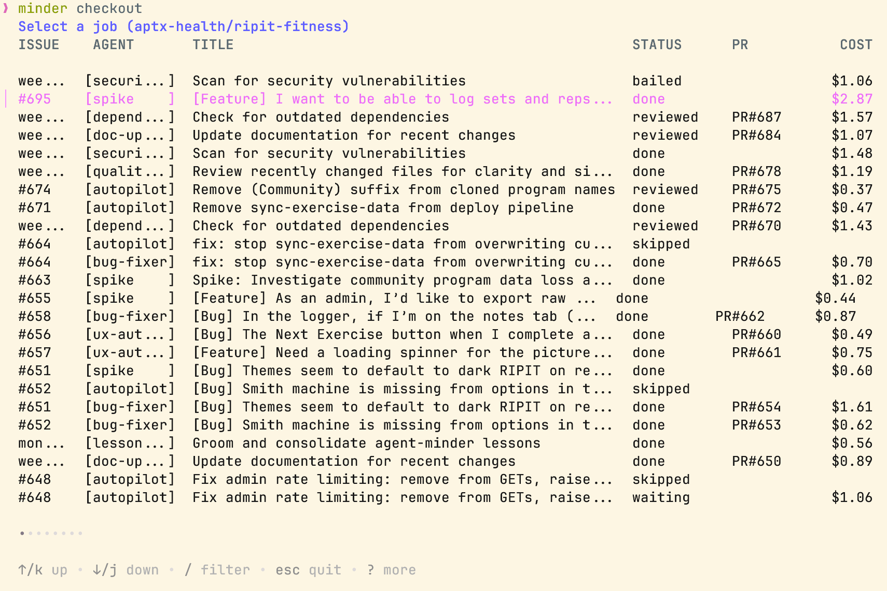
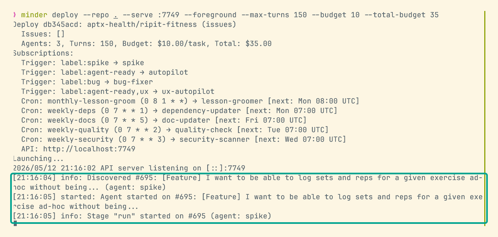

# minder

[](https://github.com/aptx-health/agent-minder/actions/workflows/ci.yml)
[](LICENSE)
[](go.mod)

A self-hosted orchestration layer for Claude Code. Automatically dispatch the right agent for the job, whether that's a scheduled cron task (dependency updates, security scans, doc syncs) or a reactive trigger from a GitHub label. Tag an issue with `bug` and a bug-fixer agent reproduces it, writes a regression test, and opens a PR. Runs in the foreground for inspection or as a background daemon.

Need to check in on a more complex job? Run `minder checkout` for follow-up options: view logs, restore the worktree for manual testing, resume with a fresh Claude session that has the agent's context preloaded, or jump straight to the PR.



Powers automated development on [ripit.fit](https://ripit.fit).



## Why minder?

If you want to dispatch Claude Code interactively, `claude agents` is great. minder is for the headless half: work that should happen without you typing a prompt.

A few things that make it useful as a devops-minded layer:

- The unit of work is a GitHub issue. Tag one with `bug` or `agent-ready` from anywhere — your phone, an admin panel, a Slack action, a teammate's laptop — and the right agent picks it up. No local CLI required to dispatch.
- Configuration lives in `.agent-minder/jobs.yaml`, checked into the repo. You can grep it, diff it, code-review it, and version it alongside the agent definitions in `.claude/agents/`.
- Custom agents per task type: a `spike` posts research findings as a comment, `autopilot` opens a PR, `bug-fixer` writes a regression test before fixing the code. You tag once; the routing is done.
- Multi-stage pipelines with conditional routing. After an agent opens a PR, a `reviewer` agent grades it (low-risk, needs-testing, or suspect). Low-risk PRs can auto-merge once CI passes.
- `minder enroll` scans the repo, researches its stack and conventions, and generates tailored canonical agent definitions in `.claude/agents/`. Claude Code reads those definitions directly; Codex receives the selected definition as runtime context.
- Self-hosted and open source (MIT). Runs on your laptop in the foreground or as a daemon on a server with a remote client (`minder status --remote host:port`).

## Quick start

```bash
# Install
go install github.com/aptx-health/agent-minder/cmd/minder@latest

# Authenticate (stores token in OS keychain)
minder auth login

# Or set env var
export GITHUB_TOKEN=ghp_...

# Enroll a repo (scans, installs agents, configures jobs)
minder enroll /path/to/repo
minder enroll /path/to/repo --runtime codex

# Deploy on issues
minder deploy 42 --repo /path/to/repo --foreground

# For ongoing use: current dir, expose API, foreground visibility, generous budget
minder deploy --repo . --serve :7749 --foreground --max-turns 150 --budget 10 --total-budget 35

# Check status
minder status
```

`--serve :7749` exposes the HTTP API so `minder checkout` and `minder status` can reach the daemon. The budget flags (`--max-turns 150 --budget 10 --total-budget 35`) leave headroom for complex jobs and work well if you're on Claude Max.

## Platform support

| Platform | Status | Notes |
|----------|--------|-------|
| macOS amd64/arm64 | Supported | Primary development platform. Foreground, daemon, checkout, SQLite, keychain, and clipboard paths are expected to work. |
| Linux amd64/arm64 | Supported | Used for VPS/systemd deployments. Clipboard copy in `minder checkout` requires `wl-clipboard`, `xclip`, `xsel`, or compatible WSL clipboard utilities. |
| WSL2 | Supported as Linux | Use Linux setup steps inside the distro. Clipboard copy can use Windows `clip.exe`/PowerShell when available on PATH; otherwise the command prints the `cd` fallback. |
| Windows native | Limited | Not release-supported today. SQLite, keyring, Bubble Tea, and clipboard dependencies have Windows support, but `internal/daemon` and `internal/reaper` still use Unix-only process APIs, so `GOOS=windows go test ./...` does not compile. Use WSL2 for full `minder deploy`/daemon workflows. |

Verified support notes:

- Clipboard code uses `github.com/atotto/clipboard`, not hardcoded `pbcopy`. That library has a native Windows implementation and Linux/WSL fallbacks for `wl-copy`, `xclip`, `xsel`, `clip.exe`, and PowerShell. If clipboard setup is missing, `minder checkout` prints a `cd <worktree>` fallback.
- GitHub authentication accepts `GITHUB_TOKEN` first, then `GH_TOKEN`, then the token stored by `minder auth login`. `minder deploy` normalizes the selected token into `GITHUB_TOKEN` for daemon re-exec and agent subprocesses.
- SQLite uses `modernc.org/sqlite`, a CGo-free driver. Windows users do not need MSYS2, MinGW, or another C compiler for SQLite.
- The current TUI dependency is `github.com/charmbracelet/bubbletea v1.3.6`, which includes Windows console support and enables VT input/output. Because the native Windows binary does not compile yet, Windows Terminal support remains a dependency-level finding rather than an end-to-end verified native `minder` workflow.

## How it works

```
Issues -> Dependency graph -> Parallel agents -> Code review -> Lesson capture -> PR
```

Each agent runs in an isolated git worktree with its own branch. The supervisor manages concurrency, budget limits, and the review pipeline. Lessons from reviewer feedback get folded back into future agent prompts. Everything is tracked in SQLite at `~/.agent-minder/v2.db`.

## Features

### Job scheduler
Define recurring jobs and label triggers in `.agent-minder/jobs.yaml`, similar to a CI/CD workflow file but for autonomous coding work. Reactive triggers (label-based) and scheduled jobs (cron) sit in one file, versioned with the repo:

```yaml
jobs:
  weekly-deps:
    schedule: "0 9 * * 1"          # cron expression
    agent: dependency-updater
    runtime: codex                 # optional; falls back to deployment runtime
    model: gpt-5                   # optional; passed through to the selected runtime
    description: "Check for outdated dependencies"
    budget: 3.0

  bug-triage:
    trigger: "label:bug"           # label trigger -> agent
    agent: bug-fixer
    runtime: claude-code           # optional per-trigger override

  spike:
    trigger: "label:spike"
    agent: spike
    model: opus
    description: "Research and discovery"
    budget: 5.0

  lint-sweep:
    kind: script
    schedule: "0 7 * * *"
    command: "go test ./..."
    timeout: 10m
    env:
      GOFLAGS: "-count=1"
```

`kind: script` jobs run in the deployed repo by default, capture stdout/stderr to the job log, record zero LLM cost, and may set `working_dir:`/`workdir:` for a repo-relative or absolute working directory. Script commands are operator-authored repo config and run through `sh -c`; do not put untrusted input in `command:`.

The trigger map prints at startup so you can see exactly what's wired up:



```bash
minder jobs list                   # show schedules
minder jobs run weekly-deps        # manual trigger
minder jobs history weekly-deps    # show prior automation runs
```

### Runtime selection

The doer runtime is selected in this order:

1. Job-level `runtime:` in `.agent-minder/jobs.yaml` for scheduled or trigger-created jobs.
2. Explicit `minder deploy --runtime <claude-code|codex|opencode>`.
3. Repo default in `.agent-minder/config.yaml`:

```yaml
runtime: codex
```

4. User default in `~/.agent-minder/config.yaml`.
5. Built-in default: `claude-code`.

Run `minder doctor --repo .` to print the local runtime capability matrix and
validate any `.agent-minder/jobs.yaml` runtime/model entries before deploying.

### opencode runtime

opencode (`--runtime opencode`) is model-agnostic: it drives any provider through
[models.dev](https://models.dev) behind a shared `opencode serve` process. Select
it like any runtime — `--runtime opencode`, a job's `runtime: opencode`, or a
repo/user `config.yaml`.

**Model.** opencode has no built-in default model, so specify one as `provider/model`:

```yaml
# .agent-minder/jobs.yaml
weekly-deps:
  schedule: "0 9 * * 1"
  agent: dependency-updater
  runtime: opencode
  model: openrouter/anthropic/claude-3.5-sonnet   # provider/model
```

Other valid forms: `anthropic/claude-3-5-sonnet`, `ollama/llama3.3`, a local
OpenAI-compatible provider like `localmlx/…`. For onboarding, `minder enroll
--runtime opencode` reads the model from the `OPENCODE_MODEL` env var.

**Auth (provider env vars).** Set your provider key in the environment where
`minder deploy` runs; it is inherited by the `opencode serve` process:

```bash
export OPENROUTER_API_KEY=sk-or-...      # or ANTHROPIC_API_KEY, OPENAI_API_KEY, ...
minder deploy --repo . --runtime opencode --foreground
```

Provider credentials are read once when the shared server starts, so treat them
as deployment-level. `opencode auth login` (which writes to opencode's own config)
is an optional alternative and also works.

**Budget.** opencode has no spend-cap flag. Minder enforces the per-job budget
itself, checking accumulated real USD cost (`AssistantMessage.cost`) between
messages and stopping the job once it is exceeded.

**Permissions.** Jobs run headless-autonomous — minder injects a default
`OPENCODE_PERMISSION` policy (edit/write/bash/webfetch allowed, worktree boundary
enforced) so tool use does not stall on an approval prompt. Set `OPENCODE_PERMISSION`
yourself to override.

### Built-in agent types

| Agent | Mode | Output | Default trigger | Description |
|-------|------|--------|-----------------|-------------|
| **autopilot** | reactive | pr | `label:agent-ready` | Implements GitHub issues end-to-end |
| **reviewer** | reactive | pr | (auto) | Reviews PRs, assesses risk, makes fixes |
| **bug-fixer** | reactive | pr | `label:bug` | Reproduces bugs, writes regression tests, fixes |
| **spike** | reactive | issue | `label:spike` | Research and discovery; investigates questions and posts findings |
| **dependency-updater** | proactive | pr | cron | Scans and updates outdated dependencies |
| **security-scanner** | proactive | issue | cron | Runs security audits, reports findings |
| **doc-updater** | proactive | pr | cron | Syncs documentation with code changes |

### Agent contracts
Agents declare their behavior in YAML frontmatter in `.claude/agents/*.md`:

```yaml
---
name: dependency-updater
mode: proactive              # no issue needed
output: pr                   # opens a PR
stages:
  - name: scan
  - name: review
    agent: reviewer
    on_failure: skip
    retries: 1
context:                     # what context to inject
  - repo_info
  - file_list
  - recent_commits:7
  - lessons
dedup:                       # skip if duplicate work exists
  - branch_exists
  - open_pr_with_label:dependencies
  - recent_run:168
timeout: 1h
---

You are a dependency update agent...
```

Contract fields: `mode` (reactive/proactive), `output` (pr/issue/comment/none), `context` (providers), `dedup` (strategies), `stages` (multi-step pipeline), `timeout`.

Each agent type also declares meaningful pipeline stage names (e.g., autopilot's stage is `implement`, bug-fixer's is `fix`, spike's is `research`). Agents without explicit stages fall back to `run`.

### Context providers
Agents get context assembled from declared providers:

| Provider | Description |
|----------|-------------|
| `issue` | Issue title, body, and comments from GitHub |
| `repo_info` | Languages, test/build commands with timeout wrappers, base branch, worktree path |
| `file_list` | Repository file tree (depth 3) |
| `recent_commits:<days>` | Git log from last N days |
| `lessons` | Relevant lessons from the learning system |
| `sibling_jobs` | Other jobs in the same deployment |
| `dep_graph` | Dependency graph for the deployment |

### Multi-agent orchestration
- Up to N concurrent agents (configurable with `--max-agents`)
- Slot backfill: as agents finish, new ones start automatically
- Budget ceiling with 80% warning and automatic pause

### Automated review
After an agent opens a PR, a review agent assesses it:
- `low-risk`: clean, well-tested. Auto-merge eligible.
- `needs-testing`: looks correct but needs human verification.
- `suspect`: has issues requiring human review.

Review produces structured JSON with risk level, summary, lessons, and specific issues found. The extraction call has a 2-minute timeout to prevent hanging on concurrent reviews.

### Learning system
Minder learns from agent outcomes:
- Lessons captured automatically from review findings
- Injected into future agent prompts (~2000 token budget)
- Tracks helpful/unhelpful counts per lesson
- Scoped per repo or globally
- Grooming auto-deactivates stale lessons; LLM consolidation merges overlapping ones

```bash
minder lesson list                        # show all lessons
minder lesson add "Always run tests"      # add manually
minder lesson groom --dry-run             # preview consolidation
```

### Dedup engine
Stackable strategies prevent duplicate work:
- `open_pr` — skip if open PR exists for branch (default for reactive PR agents)
- `branch_exists` — skip if branch already exists on remote
- `open_pr_with_label:<label>` — skip if matching PR is open
- `recent_run:<hours>` — skip if same agent ran recently

Reactive PR agents automatically get `open_pr` dedup to prevent re-running issues across daemon restarts. Unlike `branch_exists`, this allows retries when the agent was interrupted (usage limit, crash) before opening a PR.

### Watch mode
Continuously poll GitHub for new issues matching a filter:

```bash
minder deploy --watch label:agent-ready --serve :7749
minder deploy --watch milestone:v2.0
```

Trigger routes from `jobs.yaml` are polled automatically — `--watch` flag is optional when triggers are configured.

### Daemon mode + HTTP API
Run as a background daemon with a REST API:

```bash
minder deploy 42 55 --serve :7749       # start daemon
curl localhost:7749/status | jq          # check status
curl localhost:7749/jobs | jq            # list jobs
minder stop <deploy-id>                  # stop daemon
```

Endpoints: `/status`, `/jobs`, `/jobs/{id}`, `/jobs/{id}/log`, `/dep-graph`, `/metrics`, `/lessons`, `/stop`, `/resume`.

### Usage limit recovery
When an agent hits a Claude Code session/usage limit, minder automatically:
1. Detects the limit (via stream events or error text patterns)
2. Sets job status to `waiting`
3. Sleeps with backoff (1h, 2h, 3h)
4. Resumes the session using `--resume <session_id>`
5. Up to 3 retry attempts before bailing

No human intervention needed.

### Command timeout wrappers
Test and build commands injected into agent context include `timeout` wrappers (default 5m for tests, 3m for builds). Configurable via `test_timeout` and `build_timeout` in `onboarding.yaml`. Prevents agents from burning turns waiting on hung processes.

### Worktree setup hook
Fresh agent worktrees may include a tracked `.agent-minder/setup.sh` hook. When present, minder runs it as `env bash .agent-minder/setup.sh` from the new worktree before preparing agent definitions or starting the runtime. Stdout and stderr are written to the job log. A non-zero exit or timeout blocks the job with the output tail in `failure_detail`, so agents do not start in a half-provisioned workspace. Configure the hook timeout with `context.setup_timeout` in `.agent-minder/onboarding.yaml` (default 5m).

### Orphan process reaper
Agent runs occasionally leave detached descendants alive in the worktree — `npm start`, `next dev`, `overmind` and similar processes call `setsid` and escape their parent's process group, so they survive the agent that spawned them. The supervisor sweeps every worktree for these orphans and kills them (SIGTERM, then SIGKILL after a 2-second grace) at three points:

- after every agent process exits (scoped to that one worktree)
- at supervisor startup (across all worktrees whose jobs are not currently running)
- on a 5-minute ticker while the supervisor is running

Each kill emits one event line in foreground mode (e.g. `[reaper] job#265 issue-699: killed pid=39076 ppid=1 cmd=next-server age=20m sig=KILL`) and a structured `component=reaper` record in `debug.log`. Active agents' processes are never touched — the sweep skips any job in `running` state. For manual cleanup or testing: `minder reaper sweep <worktree-path>`.

## SwiftBar menu bar plugin

A macOS menu bar widget that shows agent status at a glance. Supports all job statuses including `waiting` (usage limit recovery). See `xbar/minder.5s.sh`.

## Commands

| Command | Description |
|---------|-------------|
| `minder deploy [issues...] [flags]` | Launch agents on issues or start daemon |
| `minder status [deploy-id]` | Show deployment status (`--json` for structured output) |
| `minder stop [deploy-id]` | Stop a running deployment |
| `minder tui` | Launch interactive TUI dashboard |
| `minder auth login\|status\|logout` | Manage GitHub token in OS keychain |
| `minder lesson add\|list\|edit\|remove\|pin\|groom` | Manage the learning system |
| `minder jobs list\|run\|history` | View, trigger, and inspect scheduled job runs |
| `minder agents list\|show\|add` | List, inspect, or create agent definitions |
| `minder checkout [issue]` | Check out an agent's worktree for review (interactive picker, `--remote`) |
| `minder logs [issue]` | View agent log output (interactive picker, `--follow`, `--remote`, `--raw`) |
| `minder enroll [repo-dir]` | Scan a repo and generate onboarding config (`--runtime` selects Claude, Codex, or opencode for onboarding; opencode reads `OPENCODE_MODEL`) |

### Deploy flags

| Flag | Default | Description |
|------|---------|-------------|
| `--repo <dir>` | `.` | Repository directory |
| `--agent <name>` | `autopilot` | Agent type to use |
| `--runtime <name>` | hierarchy | Doer runtime override (`claude-code`, `codex`, or `opencode`) |
| `--watch <filter>` | — | Watch for issues (`label:<name>` or `milestone:<name>`) |
| `--serve <addr>` | — | Start HTTP API (e.g., `:7749`) |
| `--foreground` | — | Don't daemonize |
| `--max-agents <n>` | `3` | Concurrent agent slots |
| `--max-turns <n>` | `50` | Per-job turn limit |
| `--budget <usd>` | `5.00` | Per-job budget |
| `--total-budget <usd>` | `25.00` | Total deployment budget |
| `--auto-merge` | — | Auto-merge low-risk PRs (waits for CI) |
| `--base-branch <name>` | auto-detect | Base branch for worktrees/PRs |
| `--api-key <key>` | — | Require API key for HTTP access |

## Prerequisites

| Dependency | Purpose |
|-----------|---------|
| **Go 1.25+** | Build from source |
| **git** | Worktree management, branch operations |
| **[Claude Code CLI](https://docs.anthropic.com/en/docs/claude-code)** | Agent execution (`claude --agent`) |
| **`GITHUB_TOKEN` or `GH_TOKEN`** | GitHub API access (via env var or `minder auth login`) |
| **[gh CLI](https://cli.github.com/)** | Agents use `gh` for PR creation and issue management |

## Environment variables

| Variable | Default | Description |
|----------|---------|-------------|
| `GITHUB_TOKEN` | — | GitHub API token (or use `minder auth login`) |
| `GH_TOKEN` | — | GitHub API token fallback when `GITHUB_TOKEN` is unset |
| `MINDER_DB` | `~/.agent-minder/v2.db` | Database path |
| `MINDER_LOG` | `~/.agent-minder/debug.log` | Debug log path |
| `MINDER_DEBUG` | — | Enable structured JSON debug logging |
| `MINDER_API_KEY` | — | API key for remote daemon access |
| `OPENCODE_MODEL` | — | `provider/model` for `minder enroll --runtime opencode` |
| `OPENCODE_PERMISSION` | headless default | Override opencode's tool-permission policy (inline JSON) |
| `OPENROUTER_API_KEY`, `ANTHROPIC_API_KEY`, … | — | Provider keys for the opencode runtime (inherited by `opencode serve`) |

## Development

### Testing

```bash
go test ./...                              # all tests
go test ./internal/db/... -v               # DB + migrations
go test ./internal/supervisor/... -v       # supervisor, contracts, context, dedup
go test ./internal/scheduler/... -v        # cron parser, config, scheduler
go test ./internal/daemon/... -v           # HTTP API endpoints
```

### Debug logging

```bash
MINDER_DEBUG=1 minder deploy 42 --foreground

# Watch in another terminal
tail -f ~/.agent-minder/debug.log | jq '{time, msg, agent, issue}'
```

### Agent logs

Each agent run produces a stream-json log:

```bash
# List logs
ls ~/.agent-minder/agents/

# Watch a running agent
tail -f ~/.agent-minder/agents/<deploy-id>-issue-<N>.log | \
  jq -r 'if .type == "assistant" then (.message.content[]? |
    if .type == "tool_use" then "🔧 \(.name)" else empty end)
  else empty end'
```

## Architecture

```
cmd/minder/main.go          # Entry point
cmd/                         # Cobra commands (deploy, status, stop, lesson, jobs, agents, auth, enroll, tui)
internal/
  supervisor/                # Job manager, context providers, contracts, dedup, review, bail, templates
  scheduler/                 # Cron parser, jobs.yaml, scheduled job firing
  daemon/                    # PID files, heartbeat, HTTP API server + client
  db/                        # SQLite schema (v4), models, queries, migrations
  claudecli/                 # Claude Code CLI wrapper
  github/                    # GitHub API client (go-github, ETag caching)
  git/                       # Git CLI wrappers
  auth/                      # OS keyring integration (macOS Keychain, Linux libsecret, Windows Credential Manager)
  lesson/                    # Lesson selection, injection, grooming
  onboarding/                # Repo scanning, onboarding YAML
  discovery/                 # Language/framework detection
  agentutil/                 # Agent log parsing
  sqliteutil/                # WAL recovery
xbar/                        # macOS SwiftBar menu bar plugin
.agent-minder/               # Per-repo config (jobs.yaml, onboarding.yaml)
```

### Data storage

SQLite at `~/.agent-minder/v2.db` (WAL mode, foreign keys, single-writer via `SetMaxOpenConns(1)`). Schema v4.

| Table | Purpose |
|-------|---------|
| `deployments` | Deploy runs with config (agents, budget, model, base branch) |
| `jobs` | Work queue (agent, status, worktree, PR, cost, stages, results) |
| `job_schedules` | Cron schedules with last/next run tracking |
| `dep_graphs` | LLM-generated dependency graphs |
| `lessons` | Persistent feedback with effectiveness tracking |
| `job_lessons` | Which lessons were injected into which jobs |
| `repo_onboarding` | Cached repo scanning results |
