# Roadmap state — reconstructed 2026-08-15

A point-in-time reconstruction of where the control-plane / observability work
actually stands, assembled from GitHub milestones, open/merged PRs, and the
Cartographer's Lantern expedition docs. The intent is a self-documenting map: the
diagram carries the structure, the notes carry the "why," and the sections below
carry the detail.

> **Reading tip:** GitHub milestone *counts* are not a truthful progress signal for
> M1 — see "The trap" below. Weight by exit criteria, not closed-issue count.

## Map

```mermaid
flowchart TB
  classDef done    fill:#1b5e20,color:#fff,stroke:#2e7d32,stroke-width:1px
  classDef flight  fill:#e65100,color:#fff,stroke:#ef6c00,stroke-width:1px
  classDef todo    fill:#37474f,color:#fff,stroke:#607d8b,stroke-width:1px
  classDef blocked fill:#4a148c,color:#fff,stroke:#7b1fa2,stroke-width:1px
  classDef gate    fill:#b71c1c,color:#fff,stroke:#ef5350,stroke-width:2px
  classDef note    fill:#fff8e1,color:#3e2723,stroke:#f9a825,stroke-width:1px

  START["📍 START HERE<br/>Master checklist is <b>Expedition I §7 'Recommended route forward'</b> (Levels 0–4) in<br/>docs/research/fable-expedition/01-architecture-truth-map.md"]:::note

  subgraph M23["🧭 Cartographer's Lantern · 7 expeditions · 4 done · 57%"]
    nExp["📝 The Fable-token burn. These produced <b>durable docs, not code</b><br/>(docs/research/fable-expedition/01–04). Exp I is the app map +<br/>ranked risks + the prioritized 'what to tackle now' list."]:::note
    E14["#588-591 · Exp I–IV · decisions ✔<br/>map · ranked risks · route forward"]:::done
    E5["#592 · Exp V · runtime semantics audit<br/>⚠ GATE — blocks activity + runtime tickets"]:::gate
    E67["#593-594 · Exp VI–VII<br/>coding-quality audit · TUI operator model"]:::todo
  end

  subgraph M20["⚙️ M1 · Coordinator + Observability"]
    nTrap["📝 THE TRAP: GitHub reads 16/26 closed (~62%), but that's an issue<br/><i>count</i>, not progress. The finished half is the <b>FOUNDATION</b>; the API<br/>surface — the whole point of M1 — was never started.<br/><b>Exit-criteria-weighted ≈ ⅓ done.</b>"]:::note
    nBackfill["📝 The remaining M1 tickets (#642-652) were backfilled along<br/>Expedition I's recommended boundaries, with only dependency-free<br/>roots marked agent-ready."]:::note
    core["FOUNDATION ✔ merged<br/>coordinator · provenance · durable runs · eventbus+retention ·<br/>typed+durable events (#644) · state-provider (#607) · activation policy (#653)"]:::done
    p642["#642 · automations snapshot · PR #657"]:::flight
    p643["#643 · unified log identity · PR #656"]:::flight
    api["#647-652 · THE /api/v1 LAYER — not started ◀ real remaining M1 work<br/>scaffold → read endpoints → SSE → unix socket → legacy-wrap → exit gate"]:::blocked
    data["#645 deliverables · #646 recent activity"]:::blocked
    nEdge["📝 Live edge = the two draft PRs #642/#643 (Level-1 contracts).<br/>#647-652 is a sequential chain, correctly blocked / no-agent."]:::note
  end

  subgraph M25["🛠️ Operator Experience · Lifecycle & Resilience · 11 issues · 8 PRs up · 0 merged"]
    nM25["📝 The 'new ideas as I went' set — now a real milestone<br/>(source: design/bb-exploration.md). Independent of M1–M3.<br/>All 8 PRs are drafts waiting on review/merge."]:::note
    sched["#637-639 scheduler · history · one-shot · script jobs<br/>PRs #660-662"]:::flight
    wt["#631-633 worktree · setup hook · file copy · TTL<br/>PRs #665-666"]:::flight
    rt["#634-636 runtime · doctor · metadata · usage-limit resume<br/>PRs #663-664"]:::flight
    inj["#640-641 event sinks · user AGENTS.md<br/>PR #659"]:::flight
  end

  subgraph LATER["📺🛑 M2 TUI (#621) + M3 Safe-ops (#622) · 0%"]
    m23["Correctly blocked — cannot start until the M1 /api/v1 layer exists"]:::blocked
  end

  subgraph SEC["🔒 Off-map, open, worth triaging"]
    sec["#522 Go 1.25 stdlib · 20 CVEs · urgency:high<br/>#523 x/sys upgrade"]:::todo
  end

  START -.-> M23
  E5 -.gates.-> data
  E5 -.gates.-> rt
  core --> p642
  core --> p643
  p642 --> api
  p643 --> api
  api --> m23
```

Legend: green = merged · orange = draft PR in flight · purple = blocked/not-started ·
red = gating expedition · grey = todo · amber = explainer note.

## The expeditions (Cartographer's Lantern)

Seven expeditions, **4 done (57%)**. This was the Fable-token burn, and it left
durable docs behind rather than code:

- **I–IV (#588-591, closed)** → `docs/research/fable-expedition/01-04*.md`: the app
  map plus the prioritized recommendations.
- **V–VII (#592-594, open)**:
  - **V — runtime semantics audit (#592):** audits how the three runtimes report
    cost/sessions/turns. **This is a gate** — M1-13 (recent activity, #646) and
    several Operator-Experience runtime tickets (#635/#636) are blocked on it.
  - **VI — agentic coding quality audit (#593).**
  - **VII — TUI operator model (#594):** feeds M2.

The "what to tackle now" list is **Expedition I** (`01-architecture-truth-map.md`):
§4 ten ranked risks, §5 decision memos DM-1…DM-5, §7 the route forward in
dependency levels (Level 0 → 4). §7 is the master checklist.

## M1 — Coordinator & Observability

**The trap:** GitHub milestone counts read as ~62% (16/26 closed), which overstates
reality. The finished half is the *foundation*; the externally observable API
surface — the thing the milestone is named for — was never filed at expedition
time. Exit-criteria-weighted, Expedition I put M1 at **~⅓ done**.

| State | Issues | What it is |
|-------|--------|-----------|
| ✅ Done (merged) | M1-01→03,05→09,11,12,17 + typed envelope (#608), eventbus retention (#606), state-provider (#607), durable events (#644), activation policy (#653) | Foundation: coordinator, provenance, runs, typed+durable event log |
| 🟠 In flight (draft PRs) | #642 automations snapshot → PR #657 · #643 log identity → PR #656 | Level-1 contract layer |
| 🔴 Blocked / todo | #645 deliverables · #646 recent activity (gated on Exp V #592) · #647-652 the `/api/v1` layer | The observable surface — the actual M1 exit |

The API (`#647-652`: scaffold → read endpoints → SSE → Unix socket → legacy-wrap →
exit gate) is **not started** and is correctly labeled `blocked`/`no-agent` because
it's a sequential chain.

**Ticket backfill:** at expedition time M1-10/13/15/16/18/19→24 were "not filed."
They now exist as #642, #646, #645, #643, #644, #647-652 — filed along Expedition I
§8's recommended boundaries, with only dependency-free roots marked `agent-ready`.

## Operator Experience — Lifecycle & Resilience

Sourced from `design/bb-exploration.md`. **11 open issues (#631-641), 8 draft PRs
(#659-666), 0 merged.** Worktree lifecycle (#631-633), runtime doctor/preflight
(#634-636), scheduler riders (#637-639), event sinks + user AGENTS.md (#640-641).
Independent of M1-M3; several runtime issues are gated on Expedition V.

## M2 / M3

Both **0% and correctly blocked** — #621 (TUI) and #622 (drain) can't start until
the M1 API exists.

## Loose threads (off-map, open)

- **Security:** #522 (Go 1.25 stdlib, 20 CVEs, `urgency:high`), #523 (x/sys upgrade).
- Assorted unmilestoned: #527, #528, #531-534.

---

**Headline:** M1's foundation is solid and merged; the API surface it exists to
deliver hasn't started; the two Level-1 contract PRs (#642/#643) are the current
live edge; and Expedition V (#592) gates a chunk of both M1 and Operator-Experience
runtime work.
